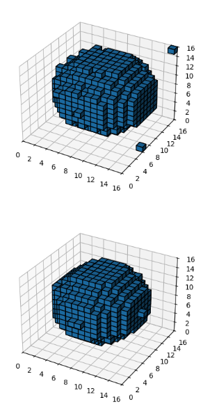
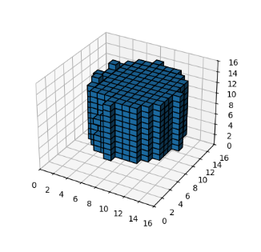
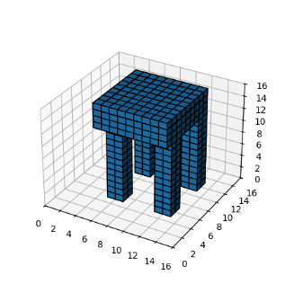

# 3d-voxel-diffusion

This is an implementation of the 3D Voxel Diffusion model for 3D object generation. 

~~In the future, this model will be used to generate Minecraft building with NBT format.~~

## Current Progress

In size 16^3 and only 1 layer (Alpha channel), the model can generate some simple 3D objects:

### Sphere

### Cylinder

### Table
