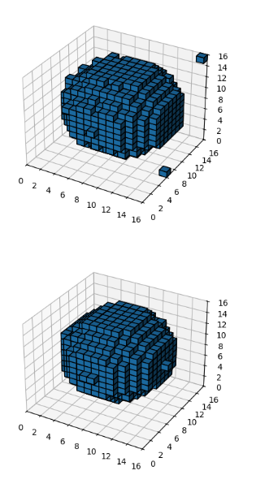
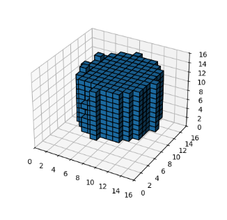
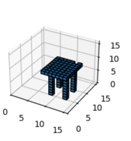
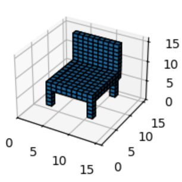

# 3d-voxel-diffusion

This is an implementation of the 3D Voxel Diffusion model for 3D object generation. 

~~In the future, this model will be used to generate Minecraft building with NBT format.~~

## Current Progress

In size 16^3 and only 1 layer (Alpha channel), the model can generate some simple 3D objects:

~~My computer is too slow to train the model with size 32^3.~~

### Sphere


### Cylinder


### Table


### Chair


### Usage

**Train the model**

```bash
python train.py --size 16 --batch 4 --epoch 10 --length 40000 --only-mask --with-label
```

**Sample the model**

```bash
python sample.py .\models\voxel_diffusion_16_3_labeled.pth --label sphere --batch 9
```