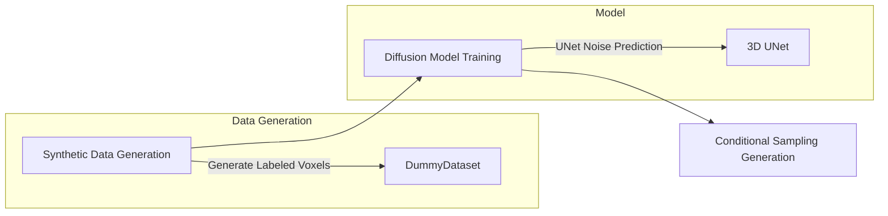

# 4. Implementation

## 4.1 Model and System Details

The system architecture is divided into three parts: **Data Generation**, **Diffusion Model**, and **3D UNet**:

### 4.1.1 Core of the Diffusion Model

- **Noise Scheduling**: Supports linear (`linear`) or cosine (`cosine`) noise scheduling, controlling noise intensity through `betas`.
- **Joint Prediction**: If the model output channels are twice that of the input, they are split into predicted noise and variance interpolation coefficient. The variance interpolation coefficient is mapped to [0,1] using an S-shaped function, mixing the preset maximum variance (β_t) and the posterior variance (𝛽̃_t) to yield the final variance. The model dynamically adjusts the variance in the reverse process via this coefficient, balancing the preset schedule with learned results to improve generation quality or accelerate sampling [19].
- **Variance Optimization**: When the model jointly predicts noise and variance, the main loss is the MSE between the predicted noise and the actual noise, with an additional loss “vb” representing the variational bound (KL divergence between the variational distribution q(x_{t-1}|x_t, x_0) and the model predicted distribution p_θ(x_{t-1}|x_t), computed via `_vb_terms_bpd`). The variance interpolation coefficient affects “vb” through KL divergence, enabling the model to adjust variance to minimize the difference between the true posterior and the predicted distribution. The final loss is `MSE + vb`, where vb is weighted and guides the optimization of the joint prediction of noise and variance via backpropagation.
- **DDIM (Denoising Diffusion Implicit Models)**: The system supports DDIM sampling.

### 4.1.2 The 3D UNet Architecture

- **Input and Output**: The input can be 4-channel voxels (RGB + alpha) or a 1-channel mask (in `only_mask` mode), and the output is the predicted noise (or the joint prediction of noise and variance).
- **Residual Blocks**: Residual blocks capture multi-scale features while alleviating gradient vanishing. Each block includes the following key layers:
  - **Convolutional Groups**: Consist of two groups of convolutions:
    - `GroupNorm`: Applies channel-wise group normalization to enhance training stability.
    - `SiLU` (Swish activation): Enhances non-linear expressiveness.
    - `Conv3d`: 3D convolution for spatial feature extraction.
  - **Skip Connection**: Uses a 1^3 convolution to align channels if the input and output channel numbers differ (otherwise uses an identity mapping).
  - **Time-step Embedding Fusion**: The time-step embedding vector is projected via a fully connected layer to match the feature map channels and then added element-wise to the convolution output for conditional time control.
- **Attention Mechanism**: The attention module models long-range dependencies to enhance the generation capability for complex shapes and boosts global modeling:
  - **Feature Normalization**: Normalizes the input feature map using group normalization.
  - **QKV Projection**: Projects the input features into Query, Key, and Value tensors with a 1^3 convolution (expanding the channels to 3 times).
  - **Self-Attention Computation**:
    - Flattens the feature map, computes the similarity matrix Q·K^T, and normalizes it with Softmax.
    - Uses scaled dot-product attention to prevent gradient explosion.
    - Formula: Attn(Q, K, V) = Softmax( (QK^T) / √d ) V.
  - **Residual Connection**: The attention output is projected back using a 1^3 convolution and added to the original input to preserve local details.
- **Intermediate Layer (Bottleneck)**: A combination of residual and attention blocks used to fuse multi-scale features.

### 4.1.3 Interactive Interface (`app.py`)

- Built with Gradio to create a visual interface supporting model training, hyperparameter tuning (e.g., learning rate, batch size), and interactive generation.
- Uses the Open3D library to convert voxel data into a 3D mesh (Triangle Mesh) for real-time preview.

## 4.2 Frameworks and Platforms

- **Deep Learning Framework**: PyTorch (for model definition, training, and inference).
- **Visualization Tools**: Matplotlib (for loss curves) and Open3D (for 3D voxel rendering).
- **Interactive Interface**: Gradio (for rapid web UI construction).
- **Hardware Requirements**: CUDA-enabled GPU is preferred (defaults to GPU; falls back to CPU if VRAM is insufficient).

## 4.3 Challenges and Solutions

### 4.3.1 Memory Limitations
   - **Problem**: Training a 32^3 voxel model exceeds 8GB GPU VRAM, leading to out-of-memory errors.
   - **Solution**: Use 16^3 for experiments.

### 4.3.2 Lack of Data Diversity
   - **Problem**: The generated 3D shapes are unevenly distributed, causing the model to overfit simple shapes (such as cubes).
   - **Solution**: 
     - Dynamically adjust shape proportions and increase the sampling frequency of complex shapes (e.g., pyramids, tables, chairs).
     - Introduce a color stratification strategy to enhance color diversity.

### 4.3.3 DDIM Sampling Stability
   - **Problem**: DDIM sampling produces voxels with voids or discontinuities.
   - **Solution**:
     - Adjust the alpha threshold (alpha=0.9) to filter out low-confidence voxels.
     - Enable noise correction (eta=0.0, i.e., fully deterministic sampling) during the reverse process to improve generation coherence.